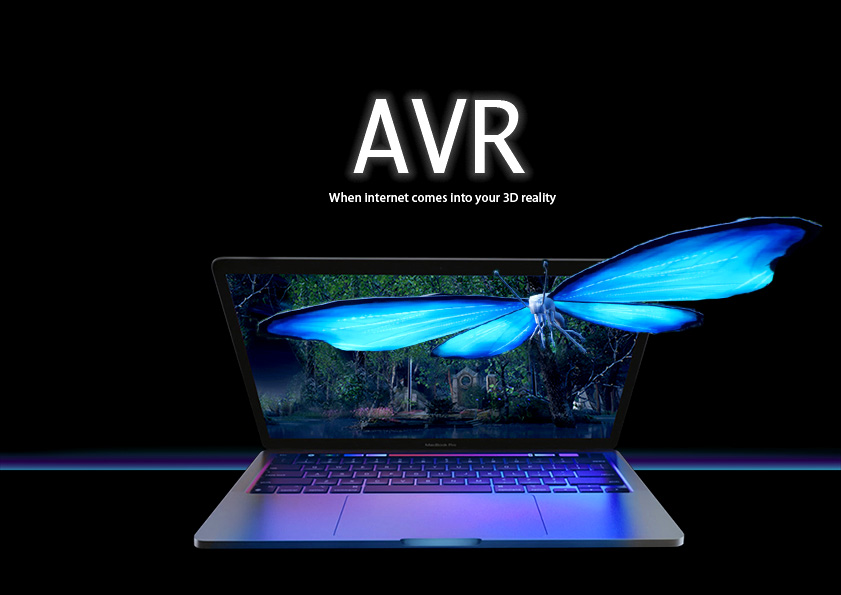
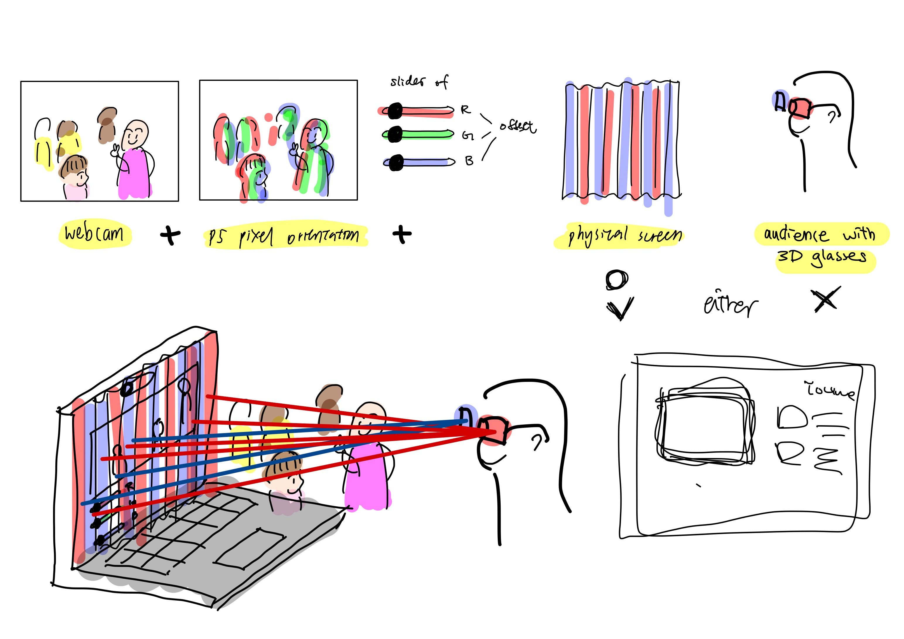

# AVR Filter

This software allows users to see their usual content on moblie devices coming out into their reality with the three dimensional visual orientation. Without buying a 3D TV, purchasing 3D produced films, wearing VR headset, or only see augumented reality in certain apps. AVR filter is a lightweight algorithm on mobile screens that runs across all platforms to bring the internet world into the real life. 

**Click here for..**
>
[💻 Web Demo](https://junebee66.github.io/AVR-Filter/weglAnaglyph/nova/nova.html)  
[🎥 Concept Video](https://youtu.be/ntalhCrsPZo)  
[⭐️ Official Website](https://www.junesbee.com/avr)  
[✍🏻 Documentation](https://github.com/junebee66/AVR-Filter)  

## **🫱 How to Use?**

Once you turn on this software on your mobile devices (laptops, phones, or tablets) you are able to see your usual content on the screen all coming forward out of the screen in a 3D orientation, similarly to the 3D film effects.

### **🛑 DISCLAIMER 🛑**
⚫️ The AVR Filter is currently under the proccess of provisional patent approval. All rights reserved.  
⚫️ Web demo is free and open source 
⚫️ The documentation is still work in progress

### **🛠️ Functionality**

**1️⃣ Virtual 3D Scene** 
>[📀 Youtube Test Mockup Here 📀](https://github.com/junebee66/AVR-Filter/weglAnaglyph/youtube.html) 
> This is a virtual 3D scene with a YouTube UI Mockup. The color of the scene is distorted with the Anaglyph Effect, so users are able to see a 3D UI when they wear Anaglyph glasses  

 

**2️⃣ Video to 3D** 
> Here are 3 film trailers you can watch in 3D with Anaglyph glasses. Each of these videos are running through the color distortion algorithm I made to stream in live with the anaglyph effect on broswer. 
> 📀WATCH...  
[📀 "Repunzel" 📀](https://junebee66.github.io/AVR-Filter/weglAnaglyph/tangled.html)
 
[📀 "Ratatouille" 📀](https://junebee66.github.io/AVR-Filter/weglAnaglyph/ratatouille.html)
 
[📀 "Elemental" 📀](https://junebee66.github.io/AVR-Filter/weglAnaglyph/index.html)
 

**3️⃣ PointCloud to 3D** 
>[🌸 PointCloud Garden 🌸](https://junebee66.github.io/AVR-Filter/weglAnaglyph/pointGarden.html) 
> This demo converts pointcloud scene into anaglyph 3D in a digital space on broswer! 

**4️⃣ Youtube in 3D** 
>[🗳️ YouTube Box 🗳️](https://junebee66.github.io/AVR-Filter/weglAnaglyph/webEmbed/webpage.html) 
> This demo embeds Youtube in a 3D digital space with all youtube ui functional! 

### **💡About**

>AVR filter is a software that recolors and re-positions the pixels on users’ mobile devices to depict 3D illusions that is similar to the visual people see in theaters for 3D films. This product aims to bridge the gap between current 2D device users into familiarizing 3D interaction with their daily used software to migrate them into using 3D devices (VR headsets and AR glasses).

<!-- #### **⭐️ PointCloud Canvas**
_-Still in devloping stage-_
> this is 

#### **⭐️ PointCloud Canvas**
_-Still in devloping stage-_
> this is 

 
  -->

## **✍🏻Process & Documentation**

**1. Three.js WebGL Environment & Anaglyph Effect** 
The original idea was to have the software picks every pixel on the screen and rearanges them. However since I had a hard time figuring out how to talk to the gpu of a laptop. I decided to re-create a digital 3D scene and set three cameras in different perspectives. Later, I re-color the picture taken from the cameras with the monochrome color (red & blue) to the individual camera and combine them together with shaders

    const vertexSource = `
    attribute vec3 color;
    uniform float time;
    uniform float size;
    varying vec3 vColor;
    varying float vGray;
    void main() {
    // To fragmentShader
    vColor = color;
    vGray = (vColor.x + vColor.y + vColor.z) / 23.0;
    //original is divided by 3

    // Set vertex size
    gl_PointSize = size * vGray * 1.0;
    //original point size is 3
    // gl_PointSize = size;

    // Set vertex position
    gl_Position = projectionMatrix * modelViewMatrix * vec4(position,1.0);
    }
    `;

    const fragmentSource = `
    varying vec3 vColor;
    varying float vGray;
    void main() {
        float gray = vGray;

    // Decide whether to draw particle
    if(gray > 0.9){
        gray = 0.0;
    }else{
        gray = 5.0;
    }

    // Set vertex color
    gl_FragColor = vec4(vColor, gray);
    }
    `;

**2. Object Detection & Point Cloud Extrusion**
Since running object detection at live (on broswer) on a video will be a lot for the computers to handle. The depth map API also does not run live. Therefore, I made a point cloud algorithm to map the brightness of the video pixel by pixel and have pixel's z-index spread out accrodingly. This way, I created a three dimension space instatnly without running object detection and is able to "film" these pixels in a three dimensional space.
    
    function drawParticles(t){
    // Update particle info
    if (particles) {
        const imageData = getImageData(video);
        const length = particles.geometry.attributes.position.count;
        for (let i = 0; i < length; i+=1) {
            const index = i * 4;
            const r = imageData.data[index]/255;
            const g = imageData.data[index+1]/255;
            const b = imageData.data[index+2]/255;
            const gray = (r+g+b) / 3;

            particles.geometry.attributes.position.setY( i , gray*10);
            
            particles.geometry.attributes.color.setX( i , r);
            particles.geometry.attributes.color.setY( i , g);
            particles.geometry.attributes.color.setZ( i , b);

        particles.geometry.attributes.position.needsUpdate = true;
        particles.geometry.attributes.color.needsUpdate = true;
    }
    }

**3. Perception Sliders**  
The effectiveness of the anaglyph effect depends on:  
 ⚫️ how close the pixels are closer to the camera,  
 ⚫️ camera angle,  
 ⚫️ the gap between the pixels,  
 ⚫️ the complexity of the image currently showing.

 In order to have all these settings avaliable at all times, I made them into sliders and placed them on the bottom of the website; therefore the user can always adjust it to their best viewing experiences.

## **☁️ Future Developement Envision**
I see this project as an attempt of XR - extended reality. I wanted to allow the digital creature who lives freely under the logic of the computer come into this physical world. This action of having things that live digitally exist in the physical world has always been my focus. Therefore, the next couple steps will be:
- find a way to run object detection live
- find a way to generate depth map live
- invent a way to do it 3D without glasses
 

I'm currently under the process of registering a provisional patent, so I can find investor who is willing to work on this with me...

## **📚 References**
[💻 Three.js Anaglyph Library](https://github.com/mrdoob/three.js/blob/master/examples/jsm/effects/AnaglyphEffect.js)  
[💻 Three.js Facemesh]()  

## **🙏🏻 Special Thanks**
Dr. Jingyun Wang 
Daniel Shiffman  
Shanwn Van Every 
Nima Niazi  
Austen Li  