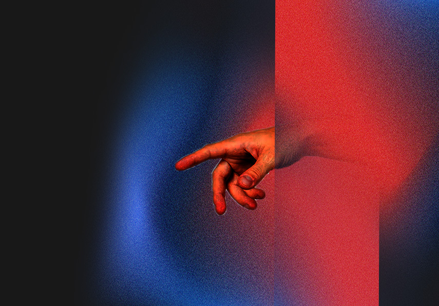

# AVR Filter

This software allows users to see their usual content on moblie devices coming out into their reality with the three dimensional visual orientation. Without buying a 3D TV, purchasing 3D produced films, wearing VR headset, or only see augumented reality in certain apps. AVR filter is a lightweight algorithm on mobile screens that runs across all platforms to bring the internet world into the real life. 

**Click here for**
>
[💻 Web Demo]()  
[🎥 Concept Video]()  
[⭐️ Official Website]()  
[✍🏻 Documentation]()  

## **🫱 How to Use?**

### **🛑 DISCLAIMER 🛑**
The AVR Filter is currently under the proccess of provisional patent approval. All rights reserved. (Web demo is free and open source)

### **🛠️ Functionality**
ddf

### **💡About**
>AVR filter is a software that recolors and re-positions the pixels on users’ mobile devices to depict 3D illusions that is similar to the visual people see in theaters for 3D films. 

## **✍🏻Process & Documentation**

https://junebee66.github.io/avr_filter/weglAnaglyph/index.html
